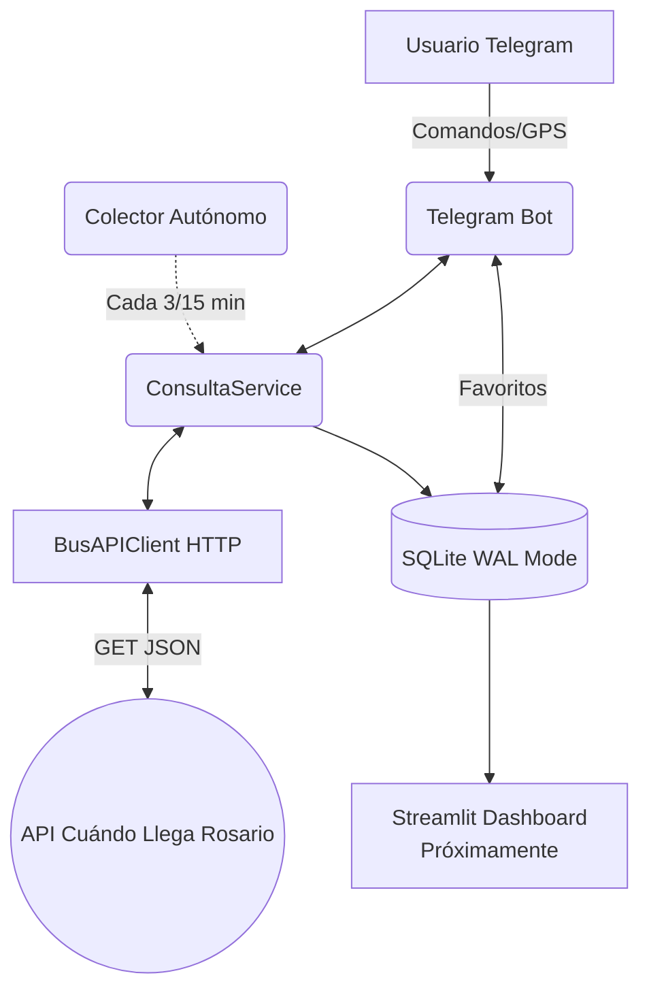

# PROJECT CONTEXT

## 1. Executive Summary
Este proyecto es un sistema integral ("end-to-end") de recolección, almacenamiento y consulta en tiempo real de datos de transporte público de la ciudad de Rosario. El problema principal que resuelve es que la aplicación oficial "Cuándo Llega" expone tiempos de arribo en tiempo real, pero **no conserva el historial**, lo que impide cualquier análisis sobre frecuencia del servicio, fiabilidad del GPS o demoras. 

El sistema provee a los usuarios una interfaz amigable a través de un Bot de Telegram para consultar los arribos, hacer "live tracking" (seguimiento continuo), buscar paradas cercanas por GPS y guardar favoritos. Simultáneamente, un recolector de datos autónomo consulta de fondo las paradas clave cada cierto tiempo, almacenando una base histórica rica para su futuro análisis en un Dashboard estadístico.

## 2. High-Level Architecture
El sistema está diseñado para ejecutarse eficientemente en hardware de muy bajos recursos (Raspberry Pi Zero 2W). 
Consiste en dos procesos principales ejecutados como demonios, conectados a una base de datos local y compartiendo la misma capa de lógica de negocio:

- **Telegram Bot (`bot/telegram_bot.py`)**: Interfaz principal del usuario. Utiliza `python-telegram-bot` (asíncrono) para despachar comandos, manejar callbacks y coordinar tareas en segundo plano (live tracking con `APScheduler`).
- **Colector Autónomo (`collector/colector.py`)**: Script en bucle infinito que consulta las estimaciones de arribo de paradas configuradas en intervalos dinámicos (3 mins en el día, 15 mins en la madrugada) de forma ininterrumpida.
- **Business Layer (`src/`)**: Capa compartida que realiza peticiones HTTP (`requests` + `tenacity`) a la API de Cuándo Llega, parsea los JSON a `dataclasses` puras y guarda en la base de datos local.
- **Database (`data/bot.db`)**: Base de datos SQLite configurada en modo WAL (Write-Ahead Logging) para permitir lectura/escritura concurrente sin bloqueos entre el bot y el colector.
- **Cloud/Dashboard**: Existe la preparación para un túnel Cloudflare hacia un Dashboard de Streamlit (nginx), pero la recolección corre localmente en la Pi.

## 3. Technology Stack
| Categoría | Tecnología | Propósito |
|------------|-------------|------------|
| Lenguaje Principal | Python 3.9 | Alta compatibilidad en sistemas ARM, uso de `dataclasses`. |
| Framework de UI | python-telegram-bot v20+ | Framework asíncrono para manejar interacciones con Telegram API. |
| Database | SQLite (WAL mode) | Almacenamiento local concurrente, liviano, sin servidor (`sqlite3` estándar). |
| HTTP Client | `requests` | Comunicación síncrona con API externa. |
| Resiliencia | `tenacity` | Backoff exponencial y reintentos ante timeouts de la API. |
| Background Jobs | `APScheduler` | Live tracking (notificaciones automáticas cada 30s) en el bot. |
| Environment | `python-dotenv` | Manejo de secretos en `.env`. |
| Sistema Operativo | DietPi / RPi OS | Despliegue en Raspberry Pi Zero 2W. |
| Process Manager | `systemd` | Mantener en ejecución el Bot y el Colector como demonios en Linux. |

## 4. Folder Structure
- `bot/`: Contiene el entry point del bot de Telegram (`telegram_bot.py`).
- `collector/`: Contiene el entry point del script de colección autónoma de datos y su configuración.
- `src/`: Capa core del sistema (Business logic, sin dependencias de CLI o Telegram).
  - `api/`: Cliente HTTP (`client.py`) y constructores de URLs (`endpoints.py`).
  - `formatters/`: Transformadores de datos hacia HTML parseable por Telegram o texto plano de consola.
  - `models/`: Definiciones de `dataclasses` puras de Python (`Arribo`, `Parada`, `ParadaCercana`).
  - `services/`: Orquestación (`consulta_service.py`) entre API y Modelos. Lógica de negocio.
  - `storage/`: Persistencia de datos en SQLite (`history.py`, `favorites.py`).
- `data/`: Directorio donde reside el archivo físico `bot.db`.
- `logs/`: Almacena logs rotativos de la aplicación.
- `scripts/`: Herramientas auxiliares de consola para inspeccionar datos (`inspeccionar_db.py`).
- `root`: Archivos de configuración general (`config.py`, `.env`, `requirements.txt`).

## 5. Entry Points
El sistema tiene dos puntos de entrada principales en modo producción, manejados por `systemd`:
1. **El Bot de Telegram**: Se lanza ejecutando `python bot/telegram_bot.py`. Carga la configuración del `.env` e inicia un `Application.builder().run_polling()`. Su systemd asociado es `colectivos-bot.service`.
2. **El Colector Autónomo**: Se lanza ejecutando `python collector/colector.py`. Inicia un loop de tipo `while True` con un `time.sleep()` dinámico según la franja horaria. Su systemd asociado es `colectivos-collector.service`.
3. Adicionalmente, existen scripts ejecutables manualmente como `python scripts/inspeccionar_db.py`.

## 6. Core Functionalities

### Consulta en Tiempo Real
- **Flujo**: El usuario manda un número de parada o GPS. `ConsultaService` orquesta la llamada a `BusAPIClient`, devuelve una lista de `Arribo`s y se formatea por `text_formatter` para mostrar un panel visual HTML en Telegram.
- **Ubicación GPS**: El bot detecta coordenadas mediante `update.message.location`, obtiene paradas cercanas por distancia matemática, toma la más próxima de forma automática y muestra estimaciones, incluyendo en histórico origen "ubicacion".

### Live Tracking (Seguimiento Continuo)
- **Flujo**: Al consultar una parada, el usuario recibe botones *Inline*. Al tocar uno de línea, se encola una tarea programada (`JobQueue` vía `APScheduler`) para esa `chat_id` y `parada_id`. 
- **Mecánica**: El bot actualiza silenciosamente (editando el mensaje) el panel de la línea requerida cada 30 segundos. Si un vehículo está a $\leq 3$ mins, manda alerta sonora/push. El tracking auto-finaliza cuando llega a $0$ min o a los $10$ minutos (timeout).

### Favoritos Aislados
- **Flujo**: `/favorito <parada> <alias> [línea]`. Almacena en la BD un vínculo en la tabla `favoritos`.
- **Mecánica**: Capa `FavoritesStorage`. Los datos de un usuario no cruzan con otros por el `user_id`. Existe un comando de listado en GUI, borrado y `/exportar` que devuelve un buffer virtual `io.BytesIO` como archivo `.csv` en el chat.

### Recolección Histórica Deduplicada
- **Mecánica**: Ambos puntos de entrada (Bot y Colector) guardan invariablemente el resultado crudo en BD mediante `HistoryStorage`. 
- **Problema de Duplicidad**: Un coche capturado a las 22:00 a $10$ min, se vuelve a capturar a las 22:03 a $7$ min. Para estadísticas se usa el "primer avistamiento". `HistoryStorage` guarda un *cache TTL* (90 mins) de `id_coche` en memoria. Si lo ve de nuevo, graba la base de datos marcando el campo `es_primer_avistamiento = 0`.

## 7. Data Flow
**Ejemplo: Un usuario consulta vía GPS (Flujo completo)**
1. Telegram despacha el payload de Location al callback `msg_ubicacion` en el bot.
2. Bot instancia el business layer `with ConsultaService() as service:`.
3. `service.buscar_paradas_cercanas(lat, lon)` invoca `BusAPIClient._get` para el endpoint de `/search`. 
4. La respuesta es convertida a una lista de objetos `ParadaCercana`.
5. Se toma el índice `0` y se llama a `service.consultar_parada(cod_sms)`.
6. El cliente HTTP hace otra petición, el JSON es transformado a una instancia general `Parada` y una lista de instancias `Arribo`. Se agrupan en `ResultadoConsulta`.
7. `HistoryStorage.guardar()` se llama para asentar el evento de manera silenciosa en las tablas `consultas` y `arribos_historico`. El `user_id` es hasheado usando SHA-256.
8. `text_formatter.formato_telegram(resultado)` genera el string HTML de respuesta.
9. El bot utiliza `update.message.reply_text()` enviando el string. 

## 8. Database Layer
**Motor**: SQLite, operando en **modo WAL (Write-Ahead Logging)** para máxima concurrencia en escritura.

**Tablas Principales:**
- `consultas`:
  - Registra el evento de consulta general.
  - Columnas: `id`, `timestamp`, `parada_id`, `parada_nombre`, `distrito`, `origen` (ej: 'parada', 'collector', 'ubicacion'), `user_id_hash`.
- `arribos_historico`:
  - Hija de `consultas` (1:N), guarda detalle de la estimación de cada coche.
  - Columnas: `id`, `consulta_id` (FK), `timestamp`, `hora_dia`, `dia_semana`, `parada_id`, `codigo_linea`, `numero_linea`, `cartel`, `minutos_estimados`, `distancia_km`, `es_adaptado`, `gps_fresco`, `id_coche`, `esta_llegando`, `es_primer_avistamiento`.
- `favoritos`:
  - `user_id`, `alias`, `parada_id`, `filtro_linea`, `created_at`. Unique key constraint en `(user_id, alias)`.

## 9. APIs & External Integrations
| Servicio | Uso | Archivo | Método |
|---------|------|---------|--------|
| **Cuándo Llega** | Obtener estimaciones de arribo (`/parada/{id}/arribos`) | `endpoints.py`, `client.py` | HTTP GET |
| **Cuándo Llega** | Buscar paradas por GPS o Query (`/search?lat=&lon=`) | `endpoints.py`, `client.py` | HTTP GET |
| **Telegram Bot API** | Eventos, respuestas y mensajería en general | `telegram_bot.py` | Polling asíncrono vía `python-telegram-bot` SDK |

**Rate Limits & Retry**: El sistema incluye reintentos automáticos a la API externa hasta 3 veces por *timeout* con "Exponential Backoff" a través de la librería `tenacity` (decorador sobre `_get` de `BusAPIClient`).

## 10. Environment Variables
Detectadas en config `.env`:

| Variable | Propósito | Requerida | Sensible |
|----------|-----------|-----------|----------|
| `TELEGRAM_BOT_TOKEN` | Credencial de Telegram para la sesión. | Sí | Sí |
| `ADMIN_IDS` | IDs de admin separados por coma. | No | No |
| `STORAGE_ENABLED` | Si `true`, activa `HistoryStorage`. Si no, se salta DB. | No | No |
| `DB_PATH` | Ubicación física del archivo `.db` (default: `data/bot.db`). | No | No |
| `LOG_LEVEL` | Nivel de logging (`INFO`, `DEBUG`). | No | No |
| `LOG_FILE` | Ubicación física del log (default: `logs/app.log`). | No | No |
| `FAVORITOS_MAX` | Límite máximo de favoritos por usuario. | No | No |

## 11. Background Processes
- **APScheduler Jobs (`tracking_<uid>`)**: Corren de manera transparente en la capa de la aplicación Telegram cada 30 segundos una vez activados por callback inline. Ejecutan `_tracking_job`. Finalizan a los 10 minutos (timeout) o al llegar a estimación 0.
- **Colector Principal (`collector/colector.py`)**: Script autónomo en ciclo `while True`, haciendo recolección sistemática.
  - De `06:00 a 23:59`: Polling cada 3 minutos (franja de hora pico).
  - De `00:00 a 05:59`: Polling cada 15 minutos (franja madrugada).

## 12. Deployment Architecture
El entorno corre localmente en un equipo con arquitectura ARM.
- Servidor Físico: Raspberry Pi Zero 2W conectada por SSH.
- SO: DietPi o Raspberry Pi OS Lite.
- Manejador de Entornos: Virtual Environment puro (`python3 -m venv`).
- Gestor de Procesos: Demonios manejados por `systemd` nativo (`colectivos-bot.service` y `colectivos-collector.service`).
- Sincronización: El código se actualiza y sincroniza desde origen mediante rsync (`DEPLOY.md`).
- No existe Docker (por recursos limitados de la placa de 512mb RAM).

## 13. Configuration Files
- `requirements.txt`: Dependencias del sistema preparadas para ARM (`requests`, `python-dotenv`, `python-telegram-bot[job-queue]`, `tenacity`, `APScheduler`).
- `.env` y `.env.example`: Configuración del entorno.
- `collector/config_colector.py`: Archivo de configuración modular en código duro que expone variables de control para el Collector autónomo (arreglo de `PARADAS` a recolectar y el rango de `FRANJAS_HORARIAS`).
- `config.py`: Parser principal que centraliza variables de ambiente a una clase `Config` Singleton para el resto del programa, e inicializa headers constantes (`User-Agent`, `Referer`).

## 14. Security Considerations
- **Privacidad PII**: El `user_id` asociado a las analíticas se expone únicamente como un hash irreversible `SHA-256` truncado en la base de datos `consultas`. 
- **Restricciones de Favoritos**: El ID del usuario está incluido en cada query SQLite de las CRUD de favoritos. Impide que un usuario lea/edite el `alias` de la parada de otro usuario.
- **Exposición API**: El cliente HTTP del software falsea el `User-Agent` haciéndose pasar por dispositivo móvil para mitigar rechazos.
- **Gestión de Sesiones**: El polling restringe el acceso al token bot leyendo del `.env`.

## 15. Observability & Logging
- Sistema de logging rotativo de `logging.handlers.RotatingFileHandler`.
- Ambos componentes generan outputs hacia `logs/app.log` y `logs/colector.log` (máx 5MB rotando en 3 backups).
- Los outputs en terminal (stdout) y las bitácoras incluyen log level, timestamp y el namespace (`__name__`).
- Systemctl actúa como observabilidad de nivel sistema en la Pi (`journalctl`).

## 16. Known Technical Debt
- **Falta de Microservicio Independiente**: Actualmente, la lógica de recolección (`colector.py`) corre importando la misma capa de lógica. Idealmente, el Collector podría ser un microservicio independiente publicando en un Message Queue, en lugar del mismo módulo compartiendo una base de dato monolítica SQLite de manera asíncrona por modo WAL.
- **Code Smells (Síncrono en Entorno Async)**: `BusAPIClient._get()` ejecuta `requests.Session().get()`, lo cual es bloqueante. Aunque `ConsultaService` es robusto, si la API falla de manera extensa, el loop de polling del Bot (asíncrono) puede enfrentarse a bloqueos momentáneos al ser código I/O síncrono. Sería más puro utilizar `aiohttp` o `httpx`.
- **Acoplamiento**: `collector.py` implementa `time.sleep()`, deteniendo su *thread*. Sería ideal reestructurarlo con `asyncio` o usar `APScheduler` como en el bot.

## 17. Missing Documentation
- No hay código implementado sobre el Dashboard Analytics (Streamlit y visualizaciones) descrito ampliamente en la documentación estática. Es un componente por construir.
- Ausencia completa de Unit Testing (`pytest`, `mock` de la API de Cuándo Llega).

## 18. How To Explain This Project To Another AI
"Este es un sistema dual escrito en Python 3.9 para RPi ARM que actúa como fachada de transporte. Posee un Bot asíncrono (python-telegram-bot) y un script Collector (polling estático), ambos leyendo el endpoint HTTP no documentado de 'Cuándo Llega Rosario'. La capa Core extrae la respuesta JSON asumiendo modelos 'Arribo' y guarda la lectura en una SQLite modo WAL. El truco principal reside en que deduplica historiales estimativos almacenando un ttl de memoria en `HistoryStorage` para generar estadísticas verídicas, las cuales el frontend oficial de la ciudad ignora. Modifica módulos sólo inyectando la lógica de negocio requerida en `src/services/` sin romper `telegram_bot.py` o el `collector.py`."

## 19. Glossary
- **Arribo**: Instancia predictiva del tiempo estimado de llegada para un vehículo específico del transporte público.
- **Cartel / Bandera**: Nombre y ramal específico de la ruta (ej: "122 ROJA", "153 NEGRA").
- **Coche**: Vehículo individual detectado por la API (identificado internamente por `id_coche`).
- **Ochava**: Modismo local refiriendo a la "Esquina" de la intersección.
- **Cod SMS / parada_id**: Identificador numérico legible para humanos de una parada específica del trayecto urbano (ej: "5742").
- **es_primer_avistamiento**: Flag lógico (0 o 1) que determina si es la primera vez en 90 min que el sistema detecta a un bus individual para prevenir métricas duplicadas en el recuento del colector.

## 20. Recommended Context Files
Si deseas modificar, refactorizar o construir sobre la arquitectura, alimenta tu ventana de contexto con estos archivos fundamentales:
- `config.py` (Punto de entrada de las variables globales)
- `src/services/consulta_service.py` (Corazón y orquestación del sistema)
- `src/api/client.py` (Lógica de interconexión API)
- `src/storage/history.py` (Para entender las sentencias SQL y esquemas de SQLite)
- `bot/telegram_bot.py` (Para entender inyecciones de comandos en la UI final)
